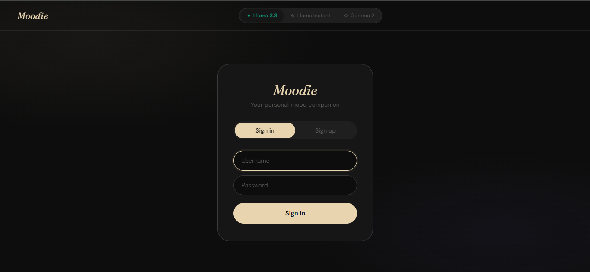
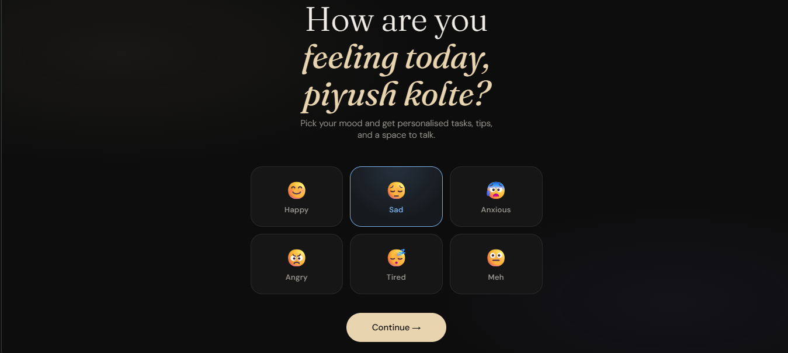
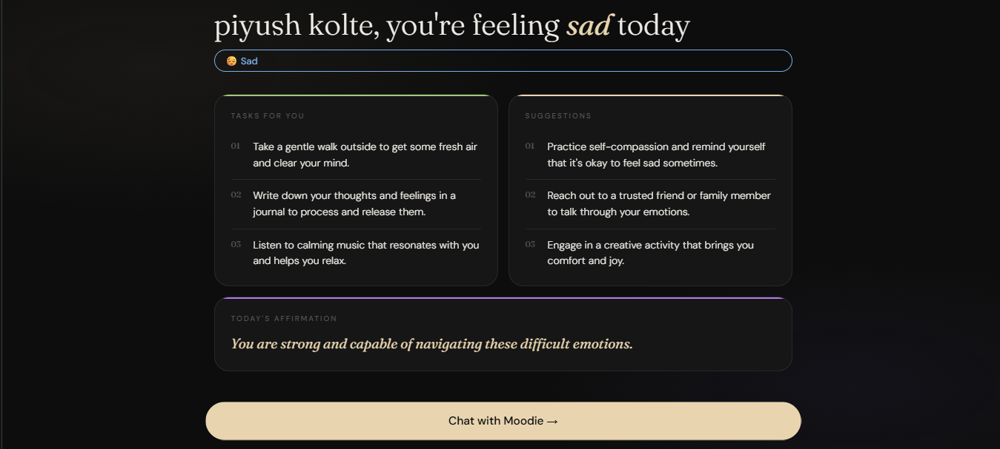
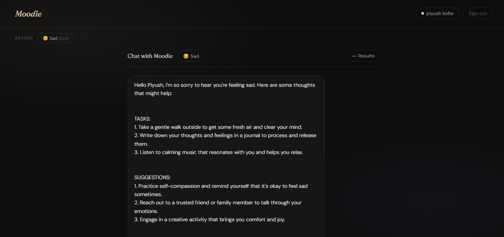

# 🌙 Moodie — AI Mood Companion

An AI-powered mood companion web app that takes your emotional input and returns personalised tasks, wellness suggestions, and a conversational AI companion — all in a single deployable project.

---
## 🖼️ Screenshots & Demo

### 🔐 Authentication


### 🎯 Mood Selection


### 📊 Results


### 💬 Chat Interface


---

## 📊 Project Presentation

📥 [Download PPT](assets/Moodie_Presentation.pptx)

or

🎥 [View PPT Online](YOUR_LINK)
## ✨ Features

- 🔐 **Login / Signup** — multi-user auth with password hashing, session persistence
- 🎯 **Mood Detection** — 6 emotional states with animated UI
- 🤖 **AI Task Generator** — Claude LLM generates 3 personalised tasks + tips + affirmation
- 💬 **Conversational Chat** — full history maintained across the session
- 💾 **Session Persistence** — user data saved in localStorage

---

## 🚀 Getting Started

### 1. Clone the repo
```bash
git clone https://github.com/yourusername/moodie.git
cd moodie
```

### 2. Add your API key
Open `js/config.js` and replace `YOUR_API_KEY_HERE` with your Claude API key:
```js
const CONFIG = {
  API_KEY: "sk-ant-your-key-here",
  ...
};
```
Get your key at: https://console.anthropic.com

### 3. Run the app
Just open `index.html` in your browser — no server or install needed.

```bash
# Or use a simple local server:
npx serve .
# then open http://localhost:3000
```

---

## 📁 Project Structure

```
moodie/
├── index.html        ← Main HTML, all screens
├── css/
│   └── style.css     ← All styles, dark theme, animations
├── js/
│   ├── config.js     ← API key + model config (⚠️ gitignored)
│   ├── auth.js       ← Login, signup, session management
│   └── app.js        ← Mood logic, API calls, chat
├── .gitignore
└── README.md
```

---

## ⚙️ Tech Stack

| Layer | Technology |
|---|---|
| Frontend | HTML5, CSS3, Vanilla JavaScript |
| AI Engine | Claude API (Anthropic) |
| Data | Browser localStorage |
| Fonts | Google Fonts (Fraunces, DM Sans) |

---

## 🔒 Security Note

`js/config.js` is listed in `.gitignore` — **never push your API key to GitHub**.  
For production deployment, move the API call to a backend server (Node.js + Express).

---

## 👥 Team

| Name | Role |
|---|---|
| [piyush] | AI Integration & Frontend Lead |
| kunal | UX Research & Mood Logic |
| kaushal| UI Design & CSS System |
| kartik | Data Layer & Testing |

---

## 📄 License

MIT License — free to use, modify, and distribute.
